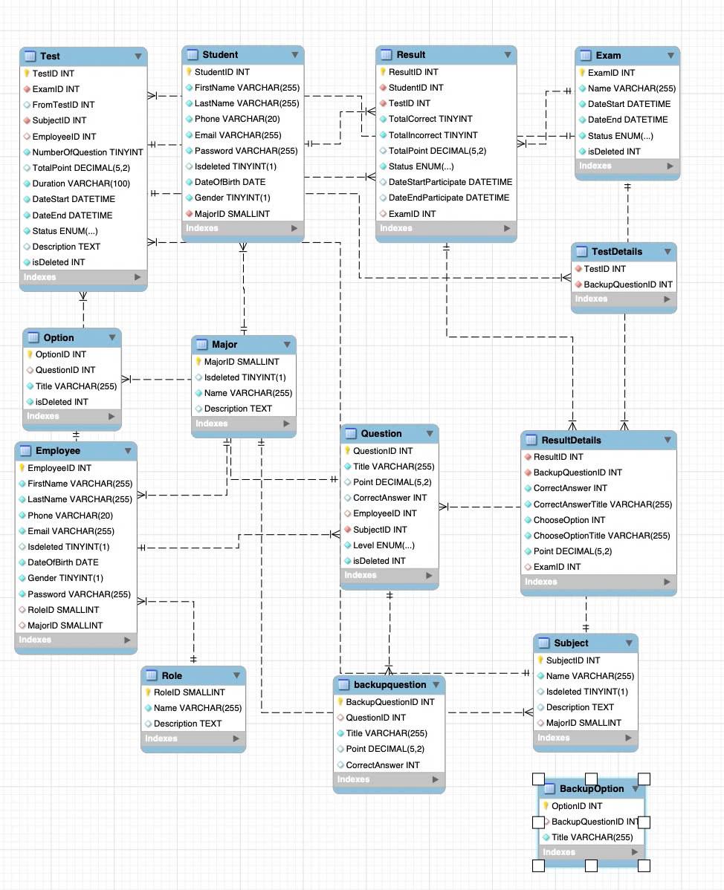
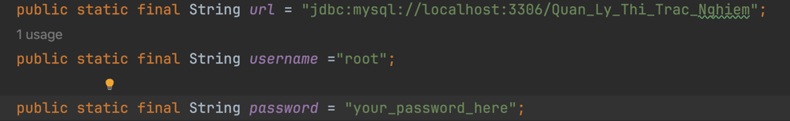

#  SGU Test 🏫
## Introduction

SGU Test is a comprehensive quiz management platform designed for teachers and students. Teachers can effortlessly create quizzes, monitor student performance, and import questions from Excel or export tests to PDF. Students can take quizzes with ease, while teachers gain valuable insights through detailed score tracking.

---

## Features
- 📝 **Create Questions and Exams**
- 🧑‍🏫 **Manage Exam Sessions**
- 📊 **Analyze and Report Exam Results**
- 📤 **Export Exam Data to Excel**
- 📄 **Generate PDF Reports**
---
## Technologies
- **Core Technology**: Java Servlet, JSP, JavaScript, ChartJS
- **Database**: MySQL

## Database Schema


---
## Installation

### Prerequisites
- **Java JDK 21+**
- **MySQL 8.0+**
- **IntelliJ IDEA**
- **Tomcat 9.0+**
### Installation Guide
#### 1. Clone the Repository
```bash
git clone https://github.com/LocNguyenSGU/SGU-Test.git
```
#### 2. Set Up the Database

##### 2.1 Import the SQL File
- In the project directory, locate the `QLTTN.sql` file
- Open **MySQL Workbench** (or any other database management tool) and import the SQL file into your database
##### 2.2 Configure Database Connection
- Open the `MysqlConfig` file located in src/main/java/config.
- Update the database connection settings, specifically the username and password fields:
- 
  **Note:** _If you’re using a different database or user credentials, please update these values accordingly.

#### 3. Set Up the Project with Tomcat Server
##### 3.1 Open the Project
- Open IntelliJ IDEA and import the project.

##### 3.2 Configure Tomcat Server
1. Ensure that Apache Tomcat is installed on your system.
  - If not, download it from [Tomcat's official website](https://tomcat.apache.org/) and set it up.

2. After Apache Tomcat is installed, change the server port to **9999**
#### 4. Run project


